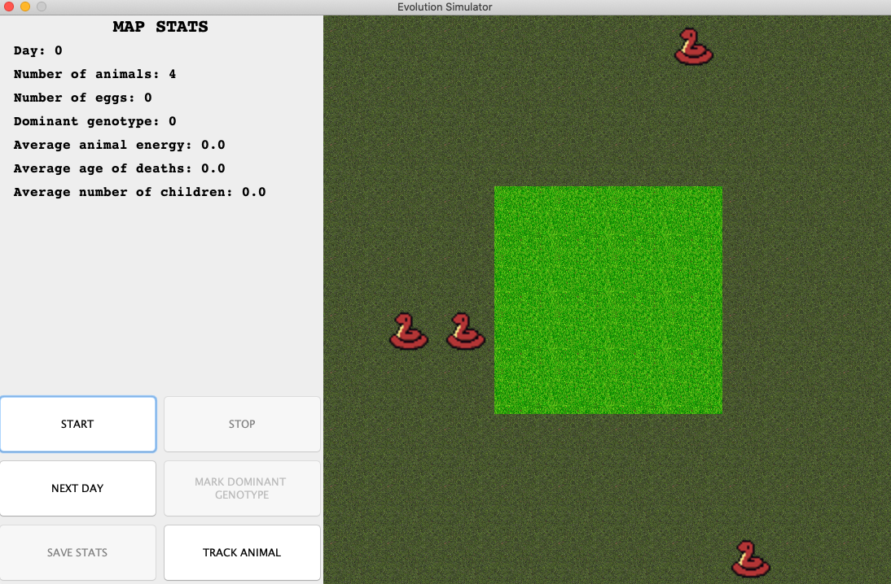
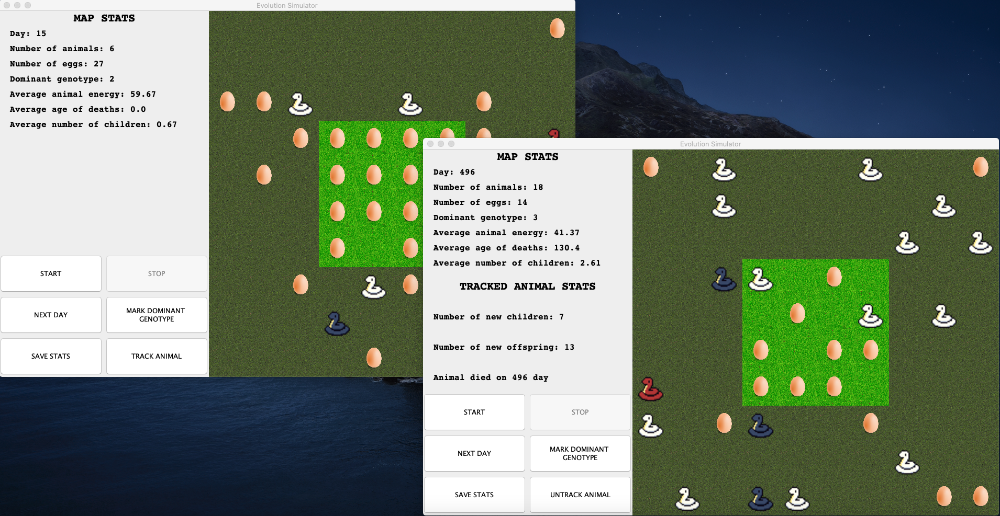
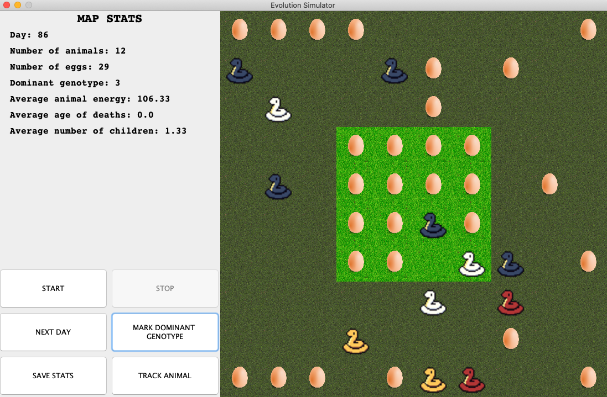
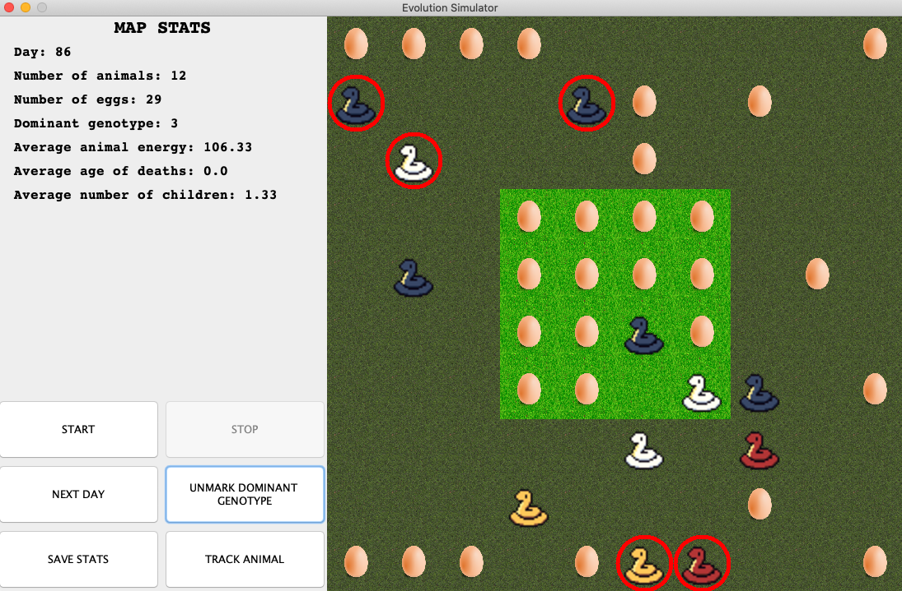
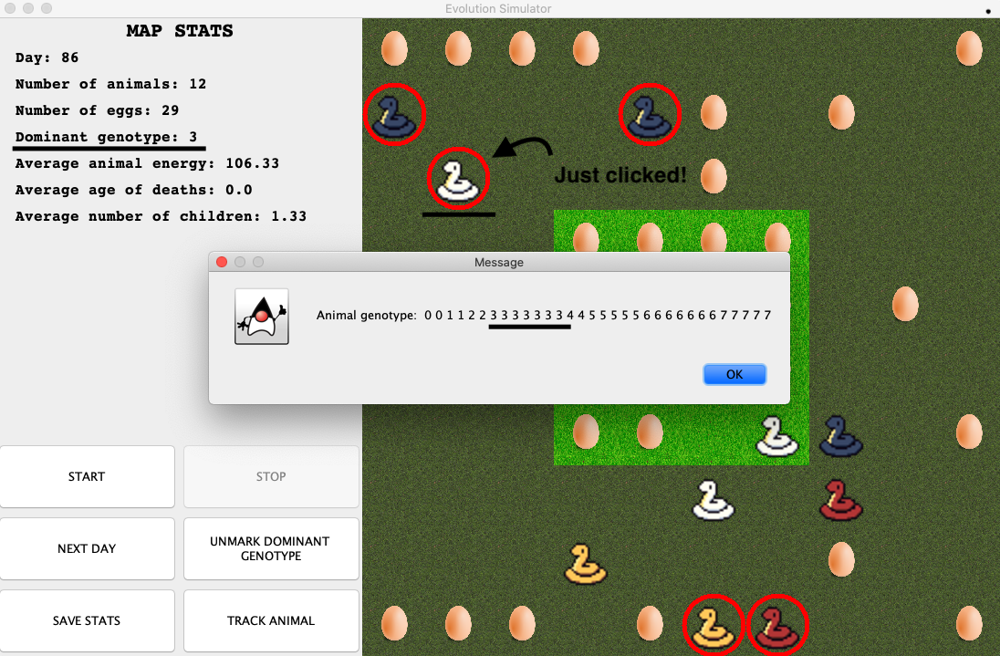
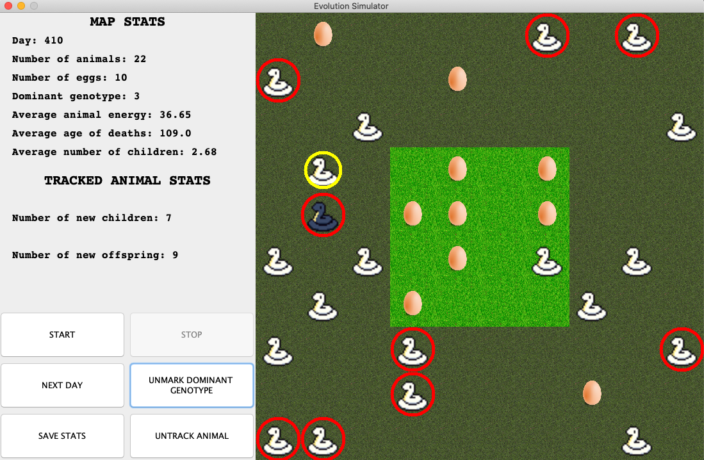
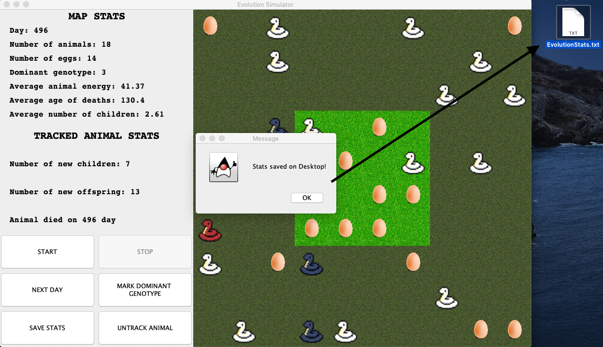
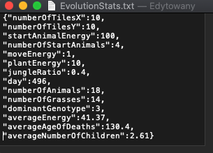

Evolution Simulator
---

Technology used:
- Java 
- Swing
- Object Oriented Programming (yes, i know it's not technology)

##### What is Evolution Simulator?
Evolution Simulator is a simulation with the simplest rules possible - best fed snakes breed when they meet and 
produce offspring, that inherits their genes.

Genes inheritance works like this:  
 - Split the genotype of animal in three parts (select two positions where crossing will happen)
 - Select two parts from one parent,   and one part from the other parent
 - Modify the genotype so at least one occurrence of given gene is present

##### How does it work?
Snakes crossing the map, when they land on a field with egg, it is eaten,
and the animal gains energy.  
When two animals meet and they have enough energy, they
breed, producing an offspring.   
If an animal has no more energy, It dies.  
There are two locations in the simulation world - the Jungle and the remaining squares.   
They both work the same way, and one egg is spawned in each 
of the squares per day. 

### The user interface  
   

User interface contains six buttons:
- start
- stop
- next day (runs simulator for one day)
- mark dominant genotype (draw red circles on snakes with dominant genotype)
- save stats (save stats about current simualtion to txt file)
- track animal (enable you to choose snake to track stats)

### We can watch two or more simulation simultaneously
  

### Color of Snake indicate his energy level
- Gold  2x   start energy
- Red   1.5x start energy
- Blue  1x   start energy
- White 0.5x start energy

  

### Dominant Genotype

### Animal Genotype

### Tracked Animal

### Saving Data

### Saved Data

